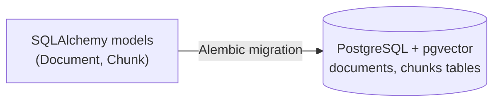
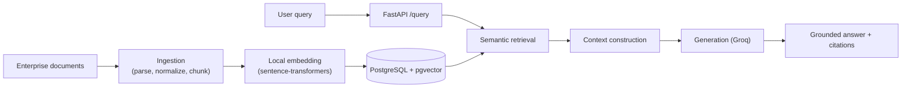

<div align="center">

# Sift

**A corpus-agnostic RAG platform that helps engineering teams get grounded, cited answers from internal technical documentation.**

[](pyproject.toml)
[](docker-compose.yml)
[](docker-compose.yml)
[](#roadmap)

</div>

---

Engineers on call, or just trying to find the right runbook, waste time checking documents one at a time because retrieval over a real technical knowledge base is genuinely hard: terminology mismatch, near-duplicate documents, exact error codes that semantic search misses, and questions with no good answer at all. Sift treats that as the actual engineering problem, not something a single LLM call papers over. Retrieval and generation quality are built and measured separately, with a real baseline before any improvement is claimed.

## Why this project exists

Enterprise engineering knowledge, runbooks, incident postmortems, architecture docs, and deployment guides, tends to be scattered, inconsistently worded, and sometimes outdated. Sift is built to retrieve and synthesize grounded answers from that kind of corpus, with citations, and to say it does not know rather than guess when the evidence is weak. Full problem statement, target user, and phase plan: [docs/ROADMAP.md](docs/ROADMAP.md).

## Engineering approach

- **No invented metrics.** Every retrieval and generation claim this project ever makes will be backed by an actual experiment run against a held-out golden query set, not asserted. Nothing has been measured yet, since the pipeline that would produce those numbers is not built yet, and this README will say so plainly until it is.
- **Baseline before improvement.** The evaluation methodology is fixed before the pipeline it will evaluate: golden query ground truth is anchored at the document section level rather than the chunk level, specifically so it survives future chunking experiments instead of needing to be relabeled every time chunk size changes.
- **Corpus-agnostic by construction, not by claim.** The database schema models document category and service as data (a hybrid of typed columns and a flexible metadata field), not as a hardcoded structure tied to one company's services.
- **Caught and fixed, not just shipped.** The default dependency resolution for local embeddings pulled in a CUDA-enabled build of PyTorch, over 500MB of unused GPU packages for a project that only ever runs embeddings on CPU. Caught by actually inspecting the lockfile, not assumed correct, and fixed by pinning to PyTorch's CPU-only package index.
- **Deliberate scope boundaries.** What is explicitly out of scope for the current phase, hybrid retrieval, reranking, auth, deployment, is documented against a phase in [docs/ROADMAP.md](docs/ROADMAP.md), not silently absent.

## What's actually working right now

- A live PostgreSQL 16 database with the pgvector extension, running locally via Docker Compose and verified (not assumed) to have the `vector` extension installed
- A two-table schema (`documents`, `chunks`) with a hybrid metadata model, defined in SQLAlchemy and applied via an Alembic migration, confirmed present in the running database
- A typed, validated configuration layer (`pydantic-settings`) as the single source of truth for environment configuration
- A CI pipeline (GitHub Actions, using `uv`) that lints and tests on every push, though no application tests exist yet since there is no application logic yet to test

Nothing beyond that is implemented yet. There is no API, no ingestion pipeline, no embedding generation, no retrieval, no generation, no corpus documents, and no evaluation set. See [Roadmap](#roadmap).

## Architecture

**Current state** (what's actually running):



**Target state** (the full system this is building toward):



## Tech stack

| Layer | In use today | Why |
|---|---|---|
| Language and tooling | Python 3.12, `uv` | Reproducible, lockfile-pinned environment; CPU-only PyTorch explicitly pinned to avoid unnecessary CUDA dependencies |
| Database | PostgreSQL 16, pgvector | Relational metadata and vector similarity search in one system, no separate vector database to operate |
| ORM and migrations | SQLAlchemy 2.0, Alembic | Typed models, versioned schema instead of hand run SQL |
| Configuration | pydantic-settings | Typed, validated environment configuration, fails fast on a missing or malformed value |
| Local dev | Docker Compose | One command Postgres and pgvector for local development |
| CI | GitHub Actions, `uv` | Lint and test on every push, using the same lockfile pinned dependencies as local dev |

| Layer | Planned | Phase |
|---|---|---|
| API | FastAPI | Phase 1 (MVP) |
| Embeddings | sentence-transformers (BAAI/bge-small-en-v1.5) | Phase 1 (MVP) |
| Generation | Groq (hosted, free tier) | Phase 1 (MVP) |
| Retrieval engineering | Hybrid and lexical search, reranking | Phase 2 |
| Evaluation subsystem | Groundedness, faithfulness, latency, cost | Phase 3 |
| Reliability and security | Auth, permissions, prompt injection defenses | Phase 4 |
| Deployment and observability | Cloud hosting, structured logging, tracing | Phase 5 |

## Roadmap

- [x] Repository bootstrap, tooling, and local Postgres plus pgvector
- [x] Database schema, migrated and verified live
- [ ] Phase 1, baseline RAG *(current: corpus authoring and ingestion pipeline next)*
- [ ] Phase 2, retrieval engineering
- [ ] Phase 3, evaluation as a first class subsystem
- [ ] Phase 4, reliability and security
- [ ] Phase 5, deployment and observability
- [ ] Phase 6, performance optimization

Full phase breakdown and scope: [docs/ROADMAP.md](docs/ROADMAP.md).

## Repository structure

```
sift/
  app/
    api/routes/     FastAPI routes (not yet implemented)
    ingestion/      Parsing, normalization, chunking (not yet implemented)
    embedding/      Local embedding generation (not yet implemented)
    retrieval/      Semantic retrieval against pgvector (not yet implemented)
    generation/     Prompt construction, Groq call, citations (not yet implemented)
    schemas/        Pydantic request and response models (not yet implemented)
    db/             SQLAlchemy models, session, Alembic migrations
    config.py       Typed application settings
  corpus/           Demo document corpus (not yet authored)
  eval/             Golden evaluation set and scoring (not yet built)
  tests/            Pytest suite
  docs/             Roadmap, and future architecture and evaluation docs
  .github/          CI workflow
```

## Local setup

```bash
git clone https://github.com/KayBee1880/Sift.git
cd Sift
cp .env.example .env
uv sync
```

Start Postgres with pgvector:
```bash
docker compose up -d
```

Apply the database schema:
```bash
uv run alembic upgrade head
```

Run the test suite:
```bash
uv run pytest
```

There is no application to run yet since `app/main.py` has no implementation. This section will grow as the ingestion pipeline and API land.

## Documentation

- [Roadmap](docs/ROADMAP.md), vision, phase plan, and current scope

## License

MIT, see [LICENSE](LICENSE).
