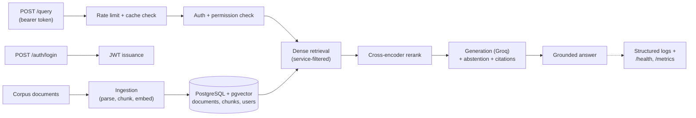

<div align="center">

# Sift

**A corpus-agnostic RAG platform that helps engineering teams get grounded, cited answers from internal technical documentation.**

[](pyproject.toml)
[](docker-compose.yml)
[](docker-compose.yml)
[](#roadmap)

</div>

---

**Live demo:** [sift-api-rn1a.onrender.com](https://sift-api-rn1a.onrender.com) (free-tier hosting — the first request after a period of inactivity can take up to a minute while the instance wakes up, and the instance may occasionally restart under real load since 512MB is a tight fit for two loaded models; a retry after a few seconds resolves it — see [docs/DEPLOYMENT.md](docs/DEPLOYMENT.md) for the confirmed details). See [Local setup](#local-setup) below for demo login credentials and example requests.

Engineers on call, or just trying to find the right runbook, waste time checking documents one at a time because retrieval over a real technical knowledge base is genuinely hard: terminology mismatch, near-duplicate documents, exact error codes that semantic search misses, and questions with no good answer at all. Sift treats that as the actual engineering problem, not something a single LLM call papers over. Retrieval and generation quality are built and measured separately, with a real baseline before any improvement is claimed.

## Why this project exists

Enterprise engineering knowledge, runbooks, incident postmortems, architecture docs, and deployment guides, tends to be scattered, inconsistently worded, and sometimes outdated. Sift is built to retrieve and synthesize grounded answers from that kind of corpus, with citations, and to say it does not know rather than guess when the evidence is weak. Full problem statement, target user, and phase plan: [docs/ROADMAP.md](docs/ROADMAP.md).

## Engineering approach

- **No invented metrics.** Every retrieval and generation change is measured against a hand-labeled, 46-query golden set before being adopted, not asserted. Chunking strategy, reranking, and the citation-filtering logic have each gone through at least one real measure-then-decide cycle, several catching a genuine bug or a measurement artifact along the way rather than confirming the expected result on the first try.
- **Baseline before improvement.** The evaluation methodology was fixed before the pipeline it evaluates: golden-set ground truth is anchored at the document-section level, not the chunk level, specifically so it survives chunking experiments instead of needing to be relabeled every time chunk boundaries change.
- **Corpus-agnostic by construction, not by claim.** The database schema models document category and service as data (a hybrid of typed columns and a flexible metadata field), not as a hardcoded structure tied to one company's services. The same service field also underpins per-service access control.
- **Caught and fixed, not just shipped.** A few examples out of several: the default dependency resolution for local embeddings pulled in a CUDA-enabled PyTorch build, 500MB of unused GPU packages for a CPU-only workload, fixed by pinning to PyTorch's CPU-only index. A generation-layer bug returned every retrieved chunk as a "citation" regardless of whether the model actually referenced it, caught by an inconsistent evaluation metric, not by inspection. Two real prompt-injection vulnerabilities (a malicious document instruction getting followed as if it were a command, and a full system-prompt leak) were found by adversarial testing and fixed before being called done.
- **Deliberate scope boundaries.** What is explicitly out of scope for the current phase is documented against a phase in [docs/ROADMAP.md](docs/ROADMAP.md), not silently absent. Hybrid/lexical retrieval, for instance, was evaluated and deliberately de-prioritized based on evidence from real error analysis, not left unbuilt by oversight.

## What's actually working right now

- **Ingestion**: a corpus of 29 real (fictional-company) markdown documents parsed, chunked (fixed-size sliding windows with measured overlap), and embedded locally (`sentence-transformers`, CPU-only), persisted to Postgres with idempotent re-ingestion (unchanged documents are skipped, not reprocessed).
- **Retrieval**: exact cosine-distance search over pgvector, re-ranked by a cross-encoder, both measured against the golden set before adoption (current configuration: Recall@5 0.9375, MRR 0.816 on the 40 answerable golden queries), with per-service access control enforced at the SQL query level so restricted content never enters a retrieved candidate list in the first place.
- **Generation**: grounded, cited answers via a hosted free-tier model (Groq), with two-layer abstention (a retrieval-similarity floor plus a model-emitted sentinel) so the system says it doesn't know rather than guessing, and citations filtered to only the sources the model actually referenced, not every chunk it was shown.
- **API**: `POST /auth/login` (JWT-based) and `POST /query`, the latter requiring authentication and enforcing the caller's service-level permissions before any retrieval happens.
- **Evaluation harness**: a golden set of 46 hand-labeled queries across straightforward, near-duplicate, multi-document, adjacent-service, exact-code, and unanswerable categories; separate runners for retrieval quality (Recall@K, MRR), generation quality (fact coverage, citation validity, abstention accuracy, latency, token cost), and a small adversarial probe set for prompt-injection resistance.
- **CI**: GitHub Actions (`uv`-based) that migrates a fresh database, ingests the corpus, lints, and runs the full test suite on every push.
- **Deployment**: live on free-tier hosting (Neon for Postgres+pgvector, Render for the API, both verified genuinely free at time of deployment — see [docs/DEPLOYMENT.md](docs/DEPLOYMENT.md)), model weights baked into the deployed image so cold starts never depend on Hugging Face Hub availability.
- **Observability**: structured (JSON) request logging, a `/health` check, and a `/metrics` JSON counter snapshot — deliberately not Prometheus/Grafana/OpenTelemetry, since there's still no measured need for that heavier tooling at this scale.
- **Reliability**: per-account rate limiting and in-memory response caching, both justified by a concrete, already-true constraint (a live, public deployment sharing one free-tier Groq API quota), not a hypothetical future one.
- **Performance**: a synthetic load-testing script (`eval/run_load_test.py`) fires real concurrent HTTP requests at a running instance and reports real latency/throughput/cache-effectiveness numbers, honestly labeled synthetic rather than organic traffic, since no real user base exists yet to measure.

Not yet built: metrics dashboards/tracing beyond the JSON counter snapshot above (still no real justification for that heavier tooling), and the bigger hybrid/lexical retrieval investment (evaluated, deliberately not pursued). See [Roadmap](#roadmap).

## Architecture



Not built beyond what's above: dashboards/tracing infrastructure
(Prometheus/Grafana/OpenTelemetry) and hybrid/lexical retrieval, both
deliberately deferred — see the "not yet built" note above and
[docs/ROADMAP.md](docs/ROADMAP.md) for why.

## Tech stack

| Layer | In use today | Why |
|---|---|---|
| Language and tooling | Python 3.12, `uv` | Reproducible, lockfile-pinned environment; CPU-only PyTorch explicitly pinned to avoid unnecessary CUDA dependencies |
| Database | PostgreSQL 16, pgvector | Relational metadata and vector similarity search in one system, no separate vector database to operate |
| ORM and migrations | SQLAlchemy 2.0, Alembic | Typed models, versioned schema instead of hand-run SQL |
| API | FastAPI | Typed request/response models, dependency-injected auth and DB sessions |
| Embeddings | sentence-transformers (`BAAI/bge-small-en-v1.5`) | Local, free, CPU-viable embedding generation |
| Reranking | `cross-encoder/ms-marco-MiniLM-L-6-v2` | Measured Recall@5 and MRR improvement over dense retrieval alone before being adopted |
| Generation | Groq (hosted, free tier) | Fast, free-tier-viable hosted inference for a portfolio-scale project |
| Auth | `bcrypt`, `PyJWT` | Minimal, focused libraries for real password hashing and signed tokens, no heavier auth framework the project's scope doesn't need |
| Configuration | pydantic-settings | Typed, validated environment configuration, fails fast on a missing or malformed value |
| Local dev | Docker Compose | One-command Postgres and pgvector for local development |
| CI | GitHub Actions, `uv` | Migrates, ingests, lints, and tests on every push against the same lockfile-pinned dependencies as local dev |

## Roadmap

- [x] Repository bootstrap, tooling, and local Postgres plus pgvector
- [x] Database schema, migrated and verified live
- [x] Phase 1, baseline RAG
- [x] Phase 2, retrieval engineering
- [x] Phase 3, evaluation as a first class subsystem
- [x] Phase 4, reliability and security *(auth/access-control, prompt-injection defense, per-account rate limiting, response caching; heavier caching layers beyond in-memory TTL left undone since a single instance has no need for a shared cache)*
- [x] Phase 5, deployment and observability *(live on free-tier hosting; structured request logging, health check, metrics snapshot; Prometheus/Grafana/tracing deliberately not built, no measured need for that scale of tooling)*
- [x] Phase 6, performance optimization *(synthetic load-testing harness measuring real latency/throughput/cache-effectiveness under generated load, honestly labeled synthetic since no organic traffic exists yet)*

Full phase breakdown and scope: [docs/ROADMAP.md](docs/ROADMAP.md).

## Repository structure

```
sift/
  app/
    api/routes/     FastAPI routes (auth, query)
    auth/           Password hashing, JWT issuance/verification, demo user seeding
    ingestion/      Parsing, chunking, embedding, the corpus ingestion pipeline
    embedding/      Local embedding generation
    retrieval/      Dense retrieval + cross-encoder reranking against pgvector
    generation/     Prompt construction, Groq call, citations, abstention
    schemas/        Pydantic request and response models
    db/             SQLAlchemy models, session, Alembic migrations
    config.py       Typed application settings
  corpus/           Demo document corpus (29 documents, fictional company)
  eval/             Golden query set and evaluation runners (retrieval, generation, injection probes)
  tests/            Pytest suite
  docs/             Roadmap
  .github/          CI workflow
```

## Local setup

```bash
git clone https://github.com/KayBee1880/Sift.git
cd Sift
cp .env.example .env
uv sync
```

Start Postgres with pgvector:
```bash
docker compose up -d
```

Apply the database schema:
```bash
uv run alembic upgrade head
```

Ingest the demo corpus:
```bash
uv run python -m app.ingestion.ingest_corpus
```

Create demo users (a Payments-only account, a Checkout-only account, and an unrestricted admin — see `app/auth/seed_users.py`):
```bash
uv run python -m app.auth.seed_users
```

Add a real, free Groq API key to `.env` (get one at [console.groq.com](https://console.groq.com)), then run the API:
```bash
uv run uvicorn app.main:app --reload
```

Log in and query it:
```bash
curl -X POST localhost:8000/auth/login -d "username=admin&password=demo-admin-pw"
curl -X POST localhost:8000/query -H "Authorization: Bearer <token from above>" -H "Content-Type: application/json" -d '{"query": "What channels does the Notifications service use?"}'
```

Run the test suite:
```bash
uv run pytest
```

## Documentation

- [Roadmap](docs/ROADMAP.md), vision, phase plan, and current scope
- [Deployment](docs/DEPLOYMENT.md), free-tier deployment to Neon + Render

## License

MIT, see [LICENSE](LICENSE).
